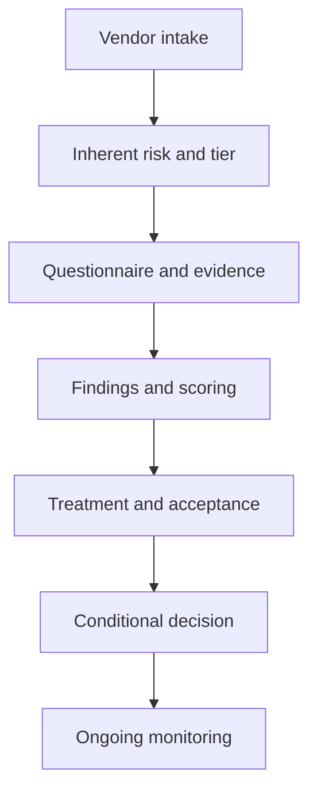

# Third-Party Vendor Risk Assessment


## Project Overview

This portfolio project demonstrates an end-to-end Third-Party Risk Management
(TPRM) assessment for **CloudPay Solutions**, a fictional Tier 1 SaaS vendor
that processes customer personal information, payment tokens, invoice data, and
financial transaction records.

The assessment follows the complete vendor lifecycle:

1. Vendor intake and scoping
2. Data-flow and criticality analysis
3. Inherent-risk scoring and tiering
4. Security and privacy questionnaire review
5. Evidence validation
6. Control-effectiveness scoring
7. Finding and residual-risk calculation
8. Risk treatment and ownership
9. Conditional approval recommendation
10. Ongoing monitoring

> **Final decision:** Conditional approval. Contracting may proceed only after
> the mandatory security and privacy clauses are executed. Production go-live
> remains blocked until the critical resilience and assurance conditions are
> validated.

## Executive Results

| Measure | Result |
|---|---:|
| Inherent risk | **92/100 – Critical** |
| Vendor tier | **Tier 1 – Critical Vendor** |
| Questionnaire score | **51/70** |
| Control effectiveness | **72.9%** |
| Residual risk | **26/100 – High** |
| Findings | **8** |
| Recommendation | **Conditional Approval** |

## Vendor Profile

| Attribute | Assessment Detail |
|---|---|
| Vendor | CloudPay Solutions, Inc. |
| Service | Hosted payment processing and customer-billing SaaS |
| Business dependency | Revenue-critical billing and invoice operations |
| Data | Customer PII, account identifiers, payment tokens, and financial records |
| Integration | Authenticated API and administrative web portal |
| Availability | 24x7; business RTO 4 hours and RPO 1 hour |
| Assessment type | Initial onboarding / pre-contract due diligence |

## Assessment Workflow



## Tiering Result

The vendor scored **92/100**, resulting in **Tier 1 – Critical** classification.
The main drivers were high-volume sensitive data, material regulatory exposure,
API connectivity, 24x7 availability requirements, and direct revenue impact.

| Inherent-Risk Factor | Rating | Weight | Weighted Points |
|---|---:|---:|---:|
| Sensitive data volume | 5 | 20% | 20 |
| System and network access | 4 | 15% | 12 |
| Business criticality | 5 | 20% | 20 |
| Regulatory and contractual impact | 5 | 15% | 15 |
| Availability dependency | 5 | 15% | 15 |
| Fourth-party reliance | 4 | 10% | 8 |
| Geographic / concentration risk | 2 | 5% | 2 |
| **Total** |  |  | **92/100** |

## Questionnaire Scorecard

Thirty-five controls were reviewed across governance, IAM, data protection,
privacy, cloud security, secure development, vulnerability management,
monitoring, incident response, resilience, fourth-party risk, personnel
security, contracts, and insurance.

| Domain | Score | Effectiveness |
|---|---:|---:|
| Governance and assurance | 6/6 | 100% |
| Identity and access | 8/8 | 100% |
| Data protection | 6/8 | 75% |
| Privacy | 4/6 | 67% |
| Cloud, network, and endpoint | 6/6 | 100% |
| Secure development | 6/6 | 100% |
| Vulnerability management | 3/6 | 50% |
| Monitoring and incident response | 7/8 | 88% |
| Resilience | 2/4 | 50% |
| Fourth-party risk | 3/4 | 75% |
| Physical and personnel security | 4/4 | 100% |
| Contract and insurance | 3/4 | 75% |

## Key Findings

| ID | Finding | Inherent Rating | Target Residual |
|---|---|---:|---:|
| F-01 | No contractually fixed incident-notification deadline | Critical | Moderate |
| F-02 | Critical vulnerability remediation allows 30 days | High | Moderate |
| F-03 | Tested recovery time misses the 4-hour business RTO | Critical | Moderate |
| F-04 | Subprocessor locations and advance notice are incomplete | High | Moderate |
| F-05 | Detailed penetration-test and retest evidence not provided | High | Low |
| F-06 | Secure-deletion evidence not independently validated | Moderate | Low |
| F-07 | Customer-notification scenario not fully exercised | Moderate | Low |
| F-08 | Standard contract limits customer audit rights | High | Moderate |

## Risk Calculation

Finding risk is calculated as:

`Likelihood × Impact`

Overall residual risk is calculated as:

`Inherent Risk × (1 − Control Effectiveness)`

`92 × (1 − 0.72) = 25.76`, rounded to **26/100 – High**.

The final rating remains High because incident notification and service recovery
represent material risk scenarios until compensating controls are validated.

## Recommendation

**Conditional approval** is recommended.

### Required before contract signature

- Execute a security addendum requiring notification within 24 hours of a
  confirmed incident affecting organizational data or services.
- Execute a Data Processing Agreement covering confidentiality, deletion,
  audit cooperation, location, and subprocessor obligations.
- Require a complete subprocessor register and 30 days' advance change notice.
- Add reasonable assurance-review and incident-triggered audit rights.
- Confirm at least $10 million in cyber-liability insurance.

### Required before production go-live

- Demonstrate recovery within the 4-hour RTO and 1-hour RPO, or obtain a formally
  approved continuity exception with a tested workaround.
- Provide a detailed sanitized penetration-test report and closure evidence for
  Critical and High findings.
- Commit to a 15-day Critical vulnerability SLA and 72-hour containment for
  actively exploited vulnerabilities.
- Validate SSO, MFA, least privilege, logging, API security, data minimization,
  retention, and deletion configuration.

## Repository Structure

```text
third-party-vendor-risk-assessment/
├── README.md
├── DISCLAIMER.md
├── docs/
│   ├── Full-Vendor-Risk-Assessment.docx
│   ├── Full-Vendor-Risk-Assessment.pdf
│   └── Executive-Recommendation.md
├── data/
│   ├── vendor-questionnaire.csv
│   ├── findings-register.csv
│   └── remediation-tracker.csv
└── templates/
    ├── evidence-request-checklist.md
    └── scoring-methodology.md
```

## Skills Demonstrated

- Third-Party Risk Management
- Cybersecurity due diligence
- Vendor tiering and inherent-risk analysis
- Security questionnaire assessment
- SOC 2 and ISO 27001 evidence review
- Privacy and data-processing risk
- Risk scoring and residual-risk analysis
- Contractual security requirements
- Corrective Action Plan development
- Executive risk recommendation
- Continuous monitoring design

## Full Report

- [Full assessment – Word](docs/Full-Vendor-Risk-Assessment.docx)
- [Full assessment – PDF](docs/Full-Vendor-Risk-Assessment.pdf)
- [Executive recommendation](docs/Executive-Recommendation.md)

## Disclaimer

This is a fictional educational portfolio project. CloudPay Solutions and all
assessment evidence are simulated. No real vendor confidential information,
credentials, customer records, or proprietary security reports are included.

